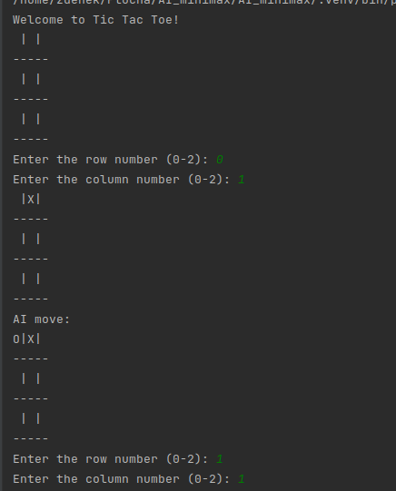

<h1>AI_minimax</h1> 

<h2>About project:</h2> 

In this project i want to program simple AI bot to play tic-tac-toe game on 3x3 gaming board.
AI is using minimax algorithm to find out the best move possible and then perform this move. Player should not
be able to beat this simple AI in this game, best possible outcome for user is draw.

<h3>About minimax algorithm:</h3>

Minimax algorithm, is used in strategic game between two players. Algorithm is building decision tree and minimalizing/maximizing the outcome. This algoritm is mostly used in game development.

 <h4>How algorithm works?:</h4>
 <ol>
   <li>Try moves</li>
   
Algorithm generates every possible move in current state and try it

   
   <li>Evaluate</li>
   
For every possible move evaluate function gets "score" to determine the best move

   <li>Minimize / Maximize</li>
   
 If it is the current players turn, the algorithm chooses the move that has maximal score so he maximize chance to win the game. If it is  opponents turn, the algorithm chooses the move that minimizes the score

   <li>Recursive call</li>
   
Algorithm is recursive calling himself for each possible move (repeating steps 1-3) until a terminal state of game (win/loss/draw) 

   <li>Choose best move</li>
   
Here algorithm takes best move possible and waits for opponent

 </ol>
 <h2>Libraries:</h2>
 
 In this project i decided to use NUMPY library to make game board(grid) and used function numpy.trace
 to check diagonals for a winner. Any other libraries used here are in base package of python 3. For version of numpy
 check file <a href="requirements.txt">requirements</a> 

 <h2>Showcase:</h2>
 
 Game starting with empty grid and waits for player to make a move. Move can be done by inserting number between 0-2 for a row and 0-2 for a column.

 After the game is over, the final statement is printed in console to find out result

 If you think, you can win, try it !

  

For the further information you can visit page <a>https://www.geeksforgeeks.org/minimax-algorithm-in-game-theory-set-1-introduction/</a>

